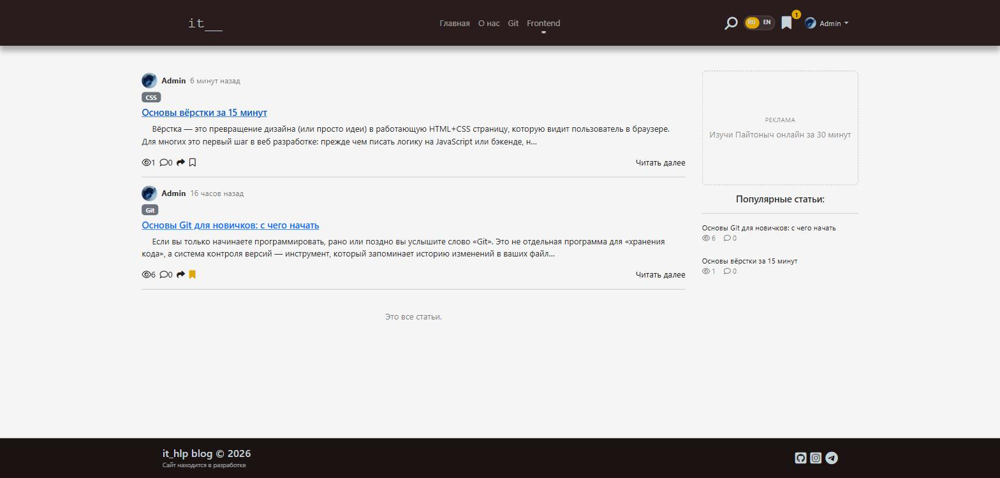
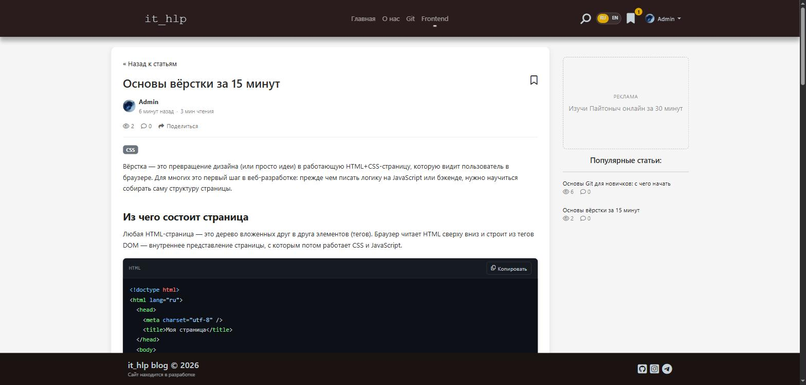
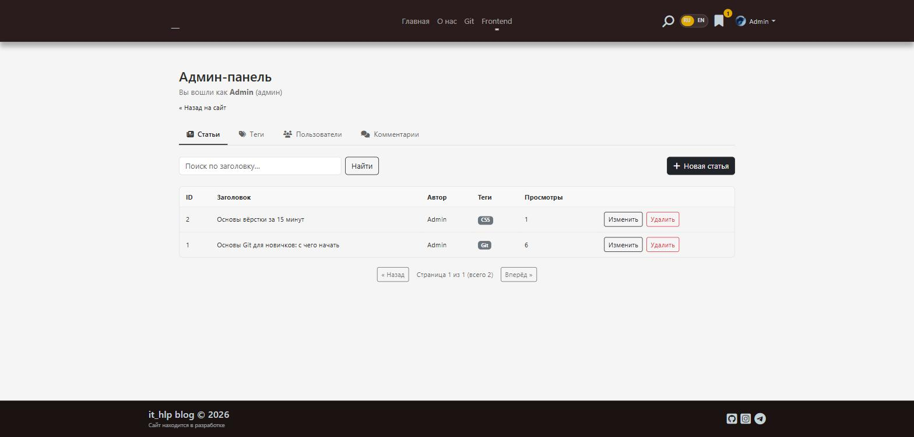
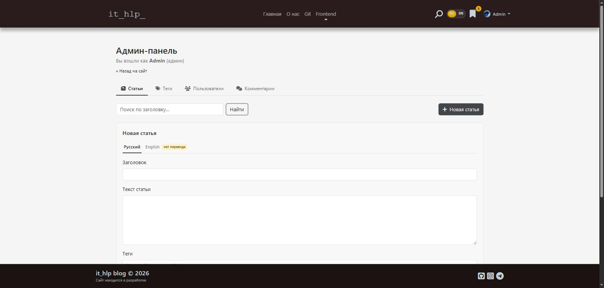
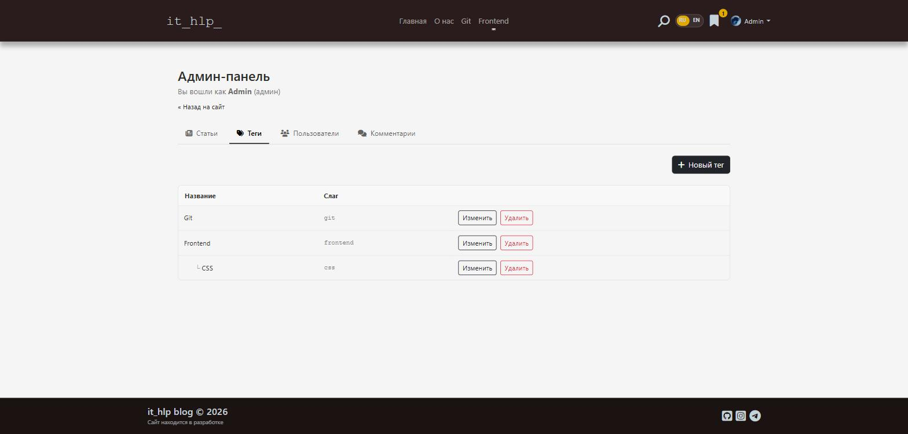
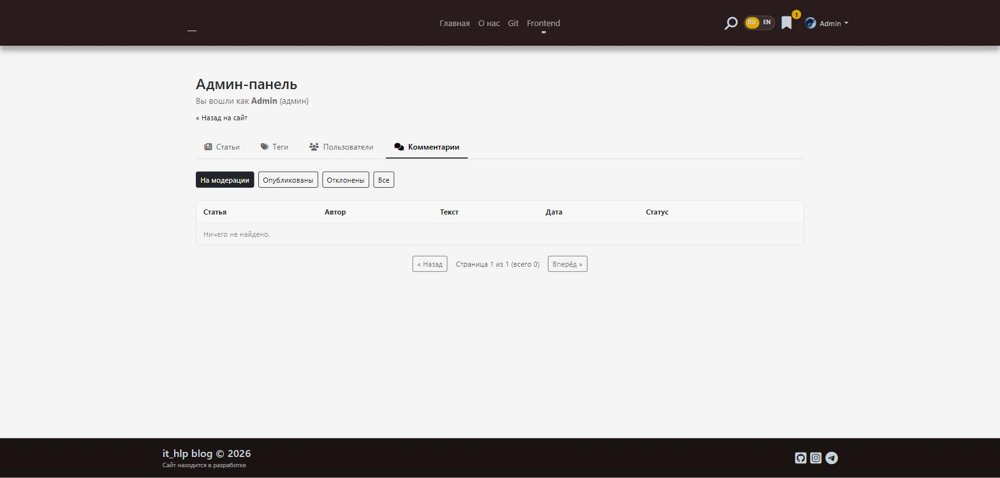

# it_hlp — IT Blog & Mini-CMS

A full-stack, bilingual (RU/EN) blog platform covering IT in general — web development,
mobile apps, game dev, design, and everything in between. Built and deployed end-to-end
as a personal project: **FastAPI + PostgreSQL** backend, **React + Vite** frontend,
Dockerized and running in production behind Nginx with automatic Let's Encrypt SSL.

**Live:** https://it-hlp.com

## Screenshots

### Public site


*Article feed with tags, view/comment counters, and a popular-articles sidebar.*


*Markdown-rendered article with syntax-highlighted code blocks and a one-click copy button.*

### Admin panel (`/admin`, role-gated)


*Article list with search and inline edit/delete.*


*Bilingual article editor — separate RU/EN tabs, tag multi-select, Markdown content.*


*Nested tag/category management.*


*Comment moderation queue (pending / published / rejected).*

## Features

**For readers**
- Live search with highlighted matches, as you type
- Favorites — save articles, synced to your account
- Comments with like/dislike voting; new comments go through moderation
- Nested tags/categories for browsing by topic
- User profile with an uploadable avatar (in-browser crop)
- Email/password login, plus Google and GitHub OAuth
- Email verification and password reset via a real transactional mailer (Resend)
- Full RU/EN localization — UI and content
- SEO: per-page meta tags, dynamically generated `sitemap.xml`, `noindex` on private pages

**Admin panel**
- Bilingual article editor (Markdown content, tag assignment, per-language tabs)
- Tag/category CRUD with parent/child nesting
- Comment moderation (approve / reject / delete)
- User management (promote to admin, suspend, delete)

## Tech stack

**Backend**
- [FastAPI](https://fastapi.tiangolo.com/) + [SQLAlchemy 2.0](https://www.sqlalchemy.org/)
- PostgreSQL in production, SQLite for local dev — switched by one `DATABASE_URL` line in
  `.env`, no code changes
- JWT auth (`python-jose`) + `passlib`/bcrypt password hashing
- OAuth 2.0 "authorization code" flow for Google & GitHub, implemented directly against
  their APIs via `urllib` — no third-party OAuth library
- Transactional email over SMTP (Resend in production)
- Google reCAPTCHA v2 on sensitive forms
- Pydantic v2 settings, fully typed request/response schemas

**Frontend**
- React 19 + Vite 7
- React Router 7 (client-side routing)
- `react-i18next` for RU/EN localization
- `react-markdown` + `remark-gfm` + `rehype-highlight` — Markdown rendering, GFM tables,
  syntax-highlighted code with a copy-to-clipboard button
- `react-easy-crop` for the avatar upload/crop flow
- Bootstrap 5 + Font Awesome for layout and icons

**Infrastructure**
- Docker multi-stage builds for both services; `docker-compose.prod.yml` orchestrates
  Postgres + backend + frontend + an nginx-certbot reverse proxy
- Automatic Let's Encrypt issuance/renewal via `jonasal/nginx-certbot` — no manual
  certificate handling
- Deployed on a Contabo VPS, DNS on Cloudflare
- `.gitattributes`-normalized line endings

## Repository structure

```
Ithelp_frontend/
├── hlp_react/                  # Frontend — React + Vite
│   ├── Dockerfile               # multi-stage build → nginx:alpine
│   └── src/
│       ├── components/          # Header, Footer, ArticleFeed, AdminPage, AuthModal, ...
│       ├── i18n/locales/         # ru.json / en.json
│       └── api.js                # backend base URL / fetch helpers
│
├── backend_fastapi/            # Backend — FastAPI + SQLAlchemy
│   ├── Dockerfile
│   └── app/
│       ├── main.py              # entrypoint, CORS, router registration
│       ├── config.py            # settings from .env
│       ├── models/              # SQLAlchemy models
│       ├── schemas/             # Pydantic request/response schemas
│       └── routers/             # articles, tags, comments, favorites, auth, oauth, users, sitemap
│
├── deploy/nginx/                # production nginx-certbot server configs
├── docker-compose.prod.yml      # Postgres + backend + frontend + nginx-certbot
└── README.md
```

## Running locally

Two processes side by side — backend and frontend.

### Backend

```powershell
cd backend_fastapi
python -m venv venv
venv\Scripts\activate
pip install -r requirements.txt
copy .env.example .env
python seed.py                 # optional: sample articles & tags
uvicorn app.main:app --reload --port 8000
```

API docs: [http://localhost:8000/docs](http://localhost:8000/docs) (auto-generated by FastAPI).

Uses SQLite by default (`hlp.db`, created automatically) — no database setup needed.
Switch to PostgreSQL via `DATABASE_URL` in `.env`.

### Frontend

```powershell
cd hlp_react
npm install
npm run dev
```

App: [http://localhost:5173/](http://localhost:5173/)

### Full stack via Docker

```bash
docker compose up -d --build
```

## Deployment

The production stack runs on a single VPS via Docker Compose:

- **db** — PostgreSQL
- **backend** — FastAPI, built from `backend_fastapi/Dockerfile`
- **frontend** — the Vite build served by Nginx, built from `hlp_react/Dockerfile`
- **nginx-certbot** — reverse proxy in front of both; handles TLS termination and
  automatic certificate renewal for the production domains

See `DEPLOY_CHECKLIST.md` for the full deploy runbook.

---

Built and maintained by [@Lavarenka](https://github.com/Lavarenka).
